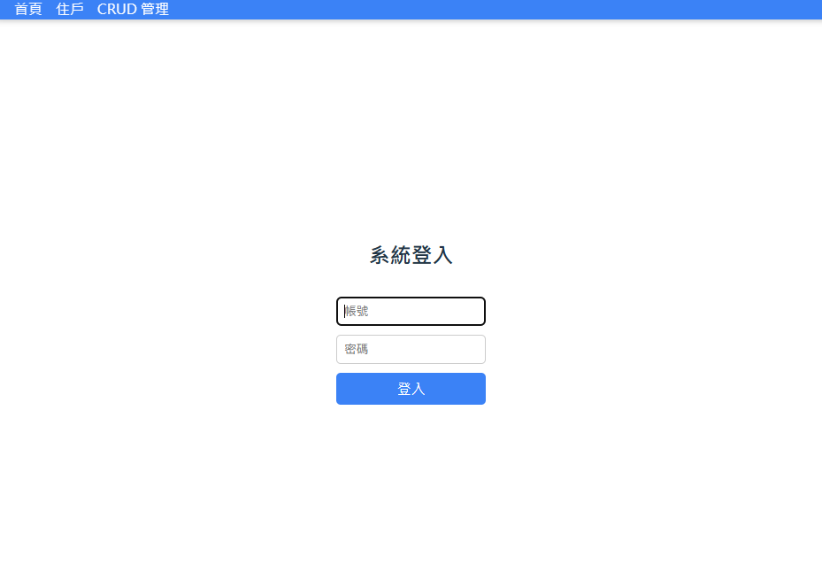
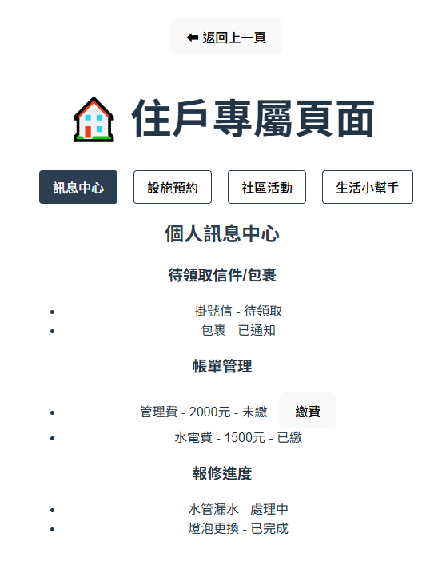
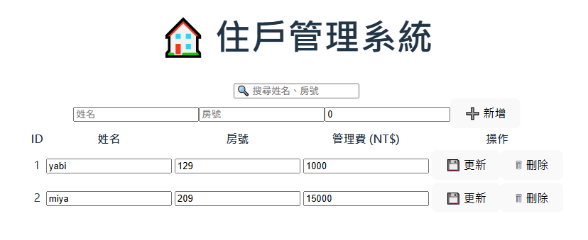
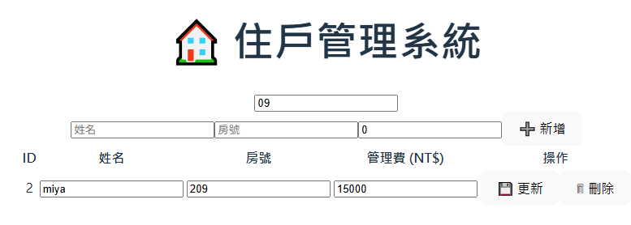
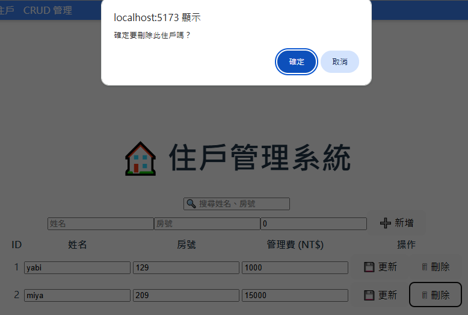
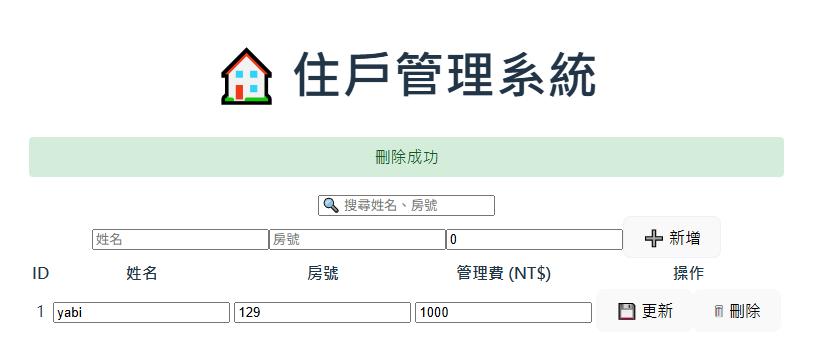
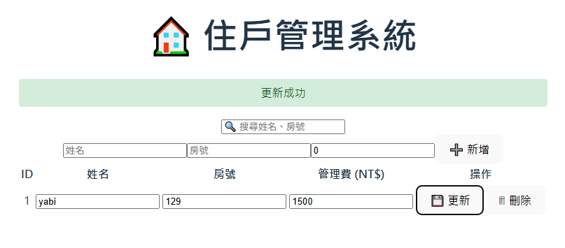

# 🏠 智慧社區住戶管理系統（Smart Community Management System）

---

## 📘 專案簡介
此專案模擬智慧社區住戶管理平台：
- 首頁呈現社區相關資訊、部分公告以及住戶動態，並且可進行其他系統操作
- 登入/登出控制
- 住戶專屬頁面，提供住戶個人訊息、公設租借、活動報名以及生活幫手功能
- 住戶管理系統，提供住戶資料的查詢、新增、修改與刪除（CRUD）

---

## 🧱 系統整體架構

Vue 3 (Frontend)

⇅ Axios API 呼叫

C# .NET8 (Backend)

⇅

MSSQL Server Database

---

## 🌐 前端頁面說明

---

### 🏠 1️⃣ 首頁（Home.vue）

首頁提供住戶，社區相關資訊。
社區公告，目前使用假資料呈現。

近期住戶動態，目前使用假資料呈現。

提供測試按鈕，以檢測是否成功連接後端。

**功能定位：**
- 系統入口，導引至登入頁面。
- 若已登入，顯示社區相關資訊，並提供其他系統操作。

**後端對應 API：**
- `GET /api/dashboard/summary`
  
---

### 🔐 2️⃣ 登入與登出頁面（Login.vue）

**功能定位：**
- 提供住戶登入。
- 目前以假資料做驗證。
- 登出返回登入頁面。

**後端對應 API：**
- `POST /api/auth/login`

---

### 🧍‍♂️ 3️⃣ 住戶專屬頁面（Residents.vue）

**功能定位：**
- 住戶專屬頁面，住戶個人主頁。
- 顯示該住戶的基本資訊與管理費繳費狀況。
- 提供住戶公設租借、活動報名等功能。
- 提供返回上一頁的功能按鈕。
- 目前皆以前端功能呈現，尚未連接後端。

---

### 🏢 4️⃣ 住戶管理頁面（ResidentsCRUD.vue）

此系統提供查詢住戶資料。

於搜尋欄位輸入住戶姓名或房號即可查詢。

對某位住戶的資料按刪除鈕，跳出是否刪除的選項。

按下確定即刪除該住戶資料，並顯示刪除成功。

對某位住戶的資料進行修改後按更新鈕，即更新該住戶資料，並顯示更新成功。

輸入新的住戶資料後按新增鈕，即新增該住戶資料，並顯示新增住戶成功。

**功能定位：**
- 簡易管理員介面，可查看與維護所有住戶資料。
- 實作完整的 CRUD 功能。

**後端對應 API：**
| 方法 | 路徑 | 功能 |
|------|------|------|
| GET | `/api/residents` | 查詢全部住戶 |
| POST | `/api/residents` | 新增住戶 |
| PUT | `/api/residents/{id}` | 修改住戶資料 |
| DELETE | `/api/residents/{id}` | 刪除住戶 |

**前端核心功能：**
- 透過 Axios 與後端同步資料。
- 表格呈現住戶清單。
- 新增 / 編輯 / 刪除表單。
- 錯誤與成功訊息顯示（O)Alert  (X)Toast。

---

## 🧠 系統邏輯說明（之後補）
- 登入狀態管理機制（Token 或 localStorage）
- 權限分流邏輯（管理員 vs 住戶）
- 資料綁定與 API 流程圖

---

## ⚙️ 技術堆疊（之後保留）
（此段延用前面技術堆疊章節）

---

## 🧾 專案啟動方式
（延用前述指令區）

---

## 🗒️ 未來可擴充方向
- 權限分層（Admin / Resident）
- 儀表板數據視覺化（管理費統計）
- API 安全性加強（JWT Token）
