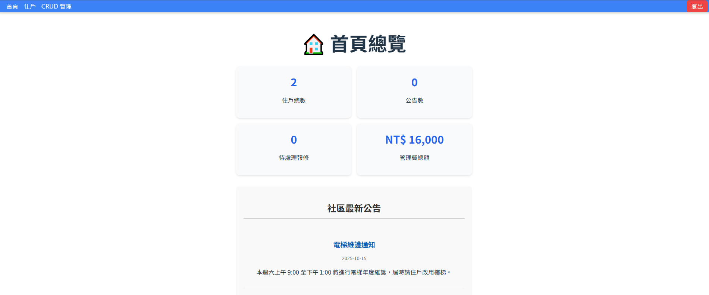
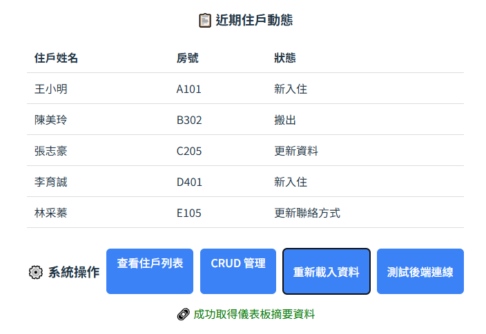
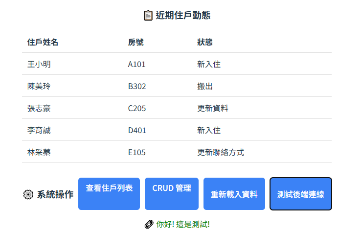

# 🏠 智慧社區住戶管理系統（Smart Community Management System）

---

## 📘 專案簡介
此專案模擬智慧社區住戶管理平台，透過帳號登入後可進行：
- 住戶資料的查詢、新增、修改與刪除（CRUD）
- 管理員登入/登出控制
- 權限分流（一般住戶 vs 管理員）
- 前後端分離串接

---

## 🧱 系統整體架構
Vue 3 (Frontend)
⇅ Axios API 呼叫
ASP.NET Core Web API (Backend)
⇅
SQL Server Database

---

## 🗂️ 專案目錄概觀
（此部分等後續前後端結構確認後補完整樹狀圖）

---

## 🌐 前端頁面說明

---

### 🏠 1️⃣ 首頁（Home.vue）

**功能定位：**
- 系統入口，導引至登入或主控頁面。
- 若已登入，顯示系統歡迎訊息與快速導向按鈕（例如「進入住戶管理」）。

**主要功能：**
- 導向登入頁面
- 顯示系統名稱與導覽

---

### 🔐 2️⃣ 登入與登出頁面（Login.vue / Logout 功能）
**功能定位：**
- 提供使用者身份驗證（管理員或住戶）。
- 登入成功後儲存 Token 或使用者資訊（例如 localStorage）。
- 登出時清除 session 資料並返回首頁。

**後端對應 API：**
- `POST /api/auth/login`
- `POST /api/auth/logout`

**說明區塊（後續補上程式實作與流程圖）**

---

### 🧍‍♂️ 3️⃣ 住戶專屬頁面（ResidentHome.vue）
**功能定位：**
- 住戶登入後的個人主頁。
- 顯示該住戶的基本資訊與管理費繳費狀況。
- 提供個人資料更新或檢視紀錄的功能（取決於角色）。

**後端對應 API：**
- `GET /api/residents/{id}`

**說明區塊（後續補上畫面範例與資料綁定流程）**

---

### 🏢 4️⃣ 住戶管理頁面（Residents.vue）
**功能定位：**
- 管理員用介面，可查看與維護所有住戶資料。
- 實作完整的 CRUD 功能。

**後端對應 API：**
| 方法 | 路徑 | 功能 |
|------|------|------|
| GET | `/api/residents` | 查詢全部住戶 |
| POST | `/api/residents` | 新增住戶 |
| PUT | `/api/residents/{id}` | 修改住戶資料 |
| DELETE | `/api/residents/{id}` | 刪除住戶 |

**前端核心功能：**
- 透過 Axios 與後端同步資料。
- 表格呈現住戶清單。
- 新增 / 編輯 / 刪除表單。
- 錯誤與成功訊息顯示（Alert / Toast）。

---

## 🧠 系統邏輯說明（之後補）
- 登入狀態管理機制（Token 或 localStorage）
- 權限分流邏輯（管理員 vs 住戶）
- 資料綁定與 API 流程圖

---

## ⚙️ 技術堆疊（之後保留）
（此段延用前面技術堆疊章節）

---

## 🧾 專案啟動方式
（延用前述指令區）

---

## 🗒️ 未來可擴充方向
- 權限分層（Admin / Resident）
- 儀表板數據視覺化（管理費統計）
- API 安全性加強（JWT Token）
