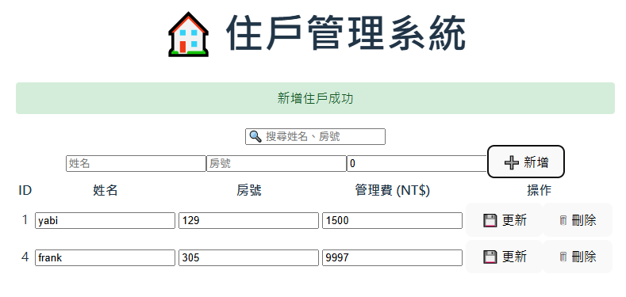

# 🏠 智慧社區住戶管理系統（Smart Community Management System）

---

## 📘 專案簡介
此專案模擬智慧社區住戶管理平台：
- 首頁呈現社區相關資訊、部分公告以及住戶動態，並且可進行其他系統操作
- 登入/登出控制
- 住戶專屬頁面，提供住戶個人訊息、公設租借、活動報名以及生活幫手功能
- 住戶管理系統，提供住戶資料的查詢、新增、修改與刪除（CRUD）

---

## 🧱 系統整體架構

Vue 3 (Frontend)

⇅ Axios API 呼叫

C# .NET8 (Backend)

⇅

MSSQL Server Database

---

## 📂 專案目錄概觀 (Project Structure Overview)

本專案採前後端分離架構，分為 **frontend (Vue3)** 與 **backend (C# .NET8)**。  
以下為主要資料夾與檔案結構概觀：

```
C-vue3/
├── frontend/                # 前端 Vue3 專案
│   ├── public/              # 靜態資源（icon、logo等）
│   ├── src/
│   │   ├── assets/          # 圖片資源
│   │   ├── components/      # 可重用元件 (Button, NavBar 等)
│   │   ├── views/           # 各頁面（Home、Login、Residents等）
│   │   ├── App.vue          # 主要應用組件
│   │   ├── router.vue       # 
│   │   └── main.js          # Vue 入口檔案
│   ├── package.json         # 前端套件與指令
│   └── vite.config.js       # Vite 設定
│
├── backend/                 # 後端 C# .NET8 專案
│   ├── Controllers/         # 控制器 (API 路由)
│   ├── Data/                # 
│   ├── Models/              # 資料模型 (Entity 定義)
│   ├── Properties/          # 
│   ├── Program.cs           # 專案進入點
│   ├── appsettings.json     # 組態設定 (資料庫連線等)
│   └── backend.csproj       # 專案組態
│
├── images/                  # README.md使用之圖檔
│
├── README.md                # 專案說明文件
└── .gitignore               # Git 忽略設定
```

---

### 🧭 專案架構說明

| 區塊 | 說明 |
|------|------|
| **frontend/** | 負責用戶端互動與頁面呈現，採用 Vue3 框架。 |
| **backend/** | 使用 ASP.NET Core 提供 RESTful API，負責資料處理與回傳。 |
| **views/** | 管理前端頁面導向（如 `Home`、`Login`、`Resident`）。 |
| **Controllers/** | 定義各 API 的端點（如 `ResidentsController`, `AuthController`）。 |
| **Models/** | 定義資料表對應模型（如 `Dashboard`, `Resident`）。 |

---

## 🌐 前端頁面說明

---

### 🏠 1️⃣ 首頁（Home.vue）


首頁提供住戶，社區相關資訊。
社區公告，目前使用假資料呈現。


近期住戶動態，目前使用假資料呈現。


提供測試按鈕，以檢測是否成功連接後端。

**功能定位：**
- 系統入口，導引至登入頁面。
- 若已登入，顯示社區相關資訊，並提供其他系統操作。

**後端對應 API：**
- `GET /api/dashboard/summary`
  
---

### 🔐 2️⃣ 登入與登出頁面（Login.vue）


**功能定位：**
- 提供住戶登入。
- 目前以假資料做驗證。
- 登出返回登入頁面。

**後端對應 API：**
- `POST /api/auth/login`

---

### 🧍‍♂️ 3️⃣ 住戶專屬頁面（Residents.vue）


**功能定位：**
- 住戶專屬頁面，住戶個人主頁。
- 顯示該住戶的基本資訊與管理費繳費狀況。
- 提供住戶公設租借、活動報名等功能。
- 提供返回上一頁的功能按鈕。
- 目前皆以前端功能呈現，尚未連接後端。

---

### 🏢 4️⃣ 住戶管理頁面（ResidentsCRUD.vue）


此系統提供查詢住戶資料。


於搜尋欄位輸入住戶姓名或房號即可查詢。


對某位住戶的資料按刪除鈕，跳出是否刪除的選項。


按下確定即刪除該住戶資料，並顯示刪除成功。


對某位住戶的資料進行修改後按更新鈕，即更新該住戶資料，並顯示更新成功。



輸入新的住戶資料後按新增鈕，即新增該住戶資料，並顯示新增住戶成功。

**功能定位：**
- 簡易管理員介面，可查看與維護所有住戶資料。
- 實作完整的 CRUD 功能。

**後端對應 API：**
| 方法 | 路徑 | 功能 |
|------|------|------|
| GET | `/api/residents` | 查詢全部住戶 |
| POST | `/api/residents` | 新增住戶 |
| PUT | `/api/residents/{id}` | 修改住戶資料 |
| DELETE | `/api/residents/{id}` | 刪除住戶 |

**前端核心功能：**
- 透過 Axios 與後端同步資料。
- 表格呈現住戶清單。
- 新增 / 編輯 / 刪除表單。
- 錯誤與成功訊息顯示（O)Alert  (X)Toast。

---

## 🗒️ 未來可擴充方向
- 住戶或管理員登入差異
- 改善部分假資料，進一步使前端連接後端使用資料庫當中的資料
- 將部分尚未完成的功能完善，例如住戶專屬頁面全面連接後端實作其功能。
- 儀表板數據視覺化（管理費統計）
- API 安全性加強
